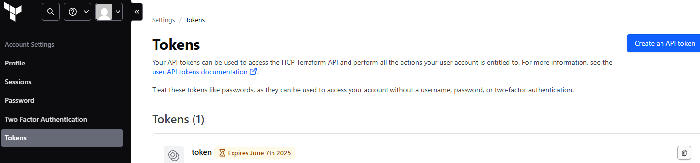
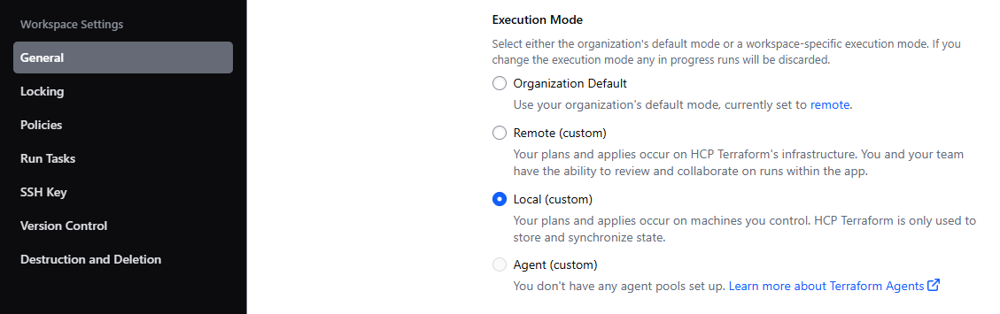

# fiap-lanchonete-infra

Criar uma Organization no HCP
Gerar um token da sua conta no HCP

Fazer login no terraform com o comando terraform login, passando esse token
https://developer.hashicorp.com/terraform/tutorials/cloud-get-started/cloud-login

Criar um workspace no HCP Terraform com o comando terraform workspace new lanchonete-infra e alterar a configuração do modo de execução para local

Adicionar as variáveis de ambiente nos projetos
TFC_AWS_RUN_ROLE_ARN = Sua Role
AWS_SESSION_TOKEN = (opcional)
AWS_SECRET_ACCESS_KEY =
access_key =
secret_key =
token_key (opcional) =

terraform init
terraform apply

Repositório contendo os arquivos de configuração (Terraform) para viabilizar o deploy da API principal do projeto. A infraestrutura é baseada no uso do AWS ECS/EC2.

## Desenvolvimento

O desenvolvimento e construção da aplicação é feito diretamente no [repositório](https://github.com/fiap-9soat/fiap-lanchonete) da API principal, onde a imagem Docker é construida e enviada diretamente ao Dockerhub, onde pode ser consumida por qualquer canal.

Criar o dev.auto.tfvars em cada pasta contendo as variáveis

terraform init
terraform apply
